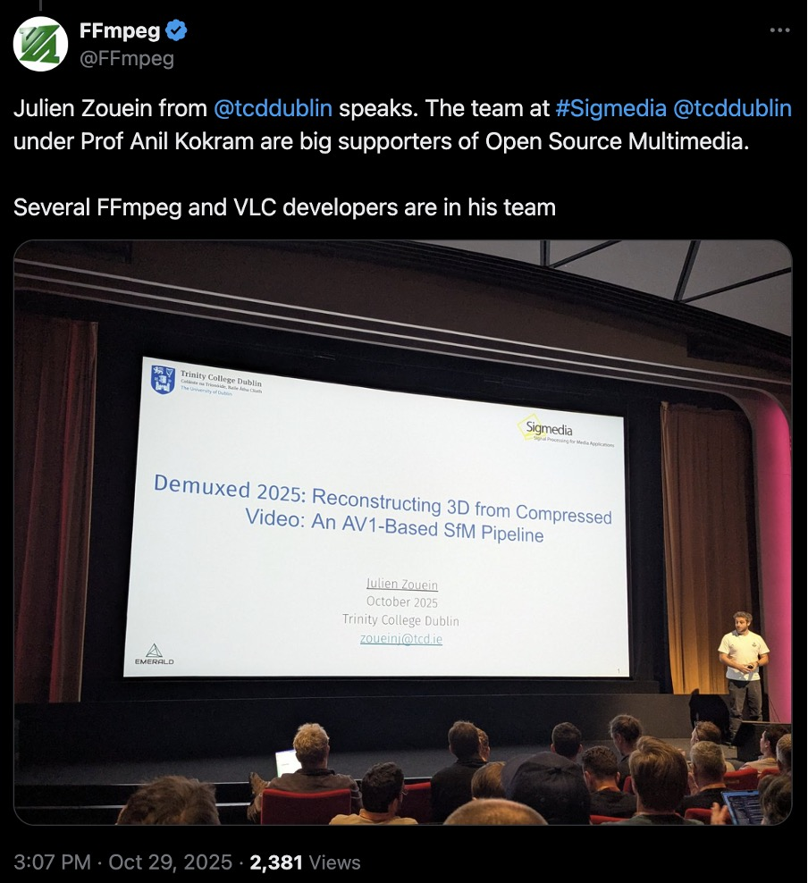

DEMUXED 2025 in London, the premier conference for video technology engineers,
featured TCD's innovative application of compression science.

Julien Zouein presented his research on lower-energy 3D reconstruction from
compressed streams. The talk generated buzz in the community, drawing attention
from major projects like FFMPEG and VLC.

