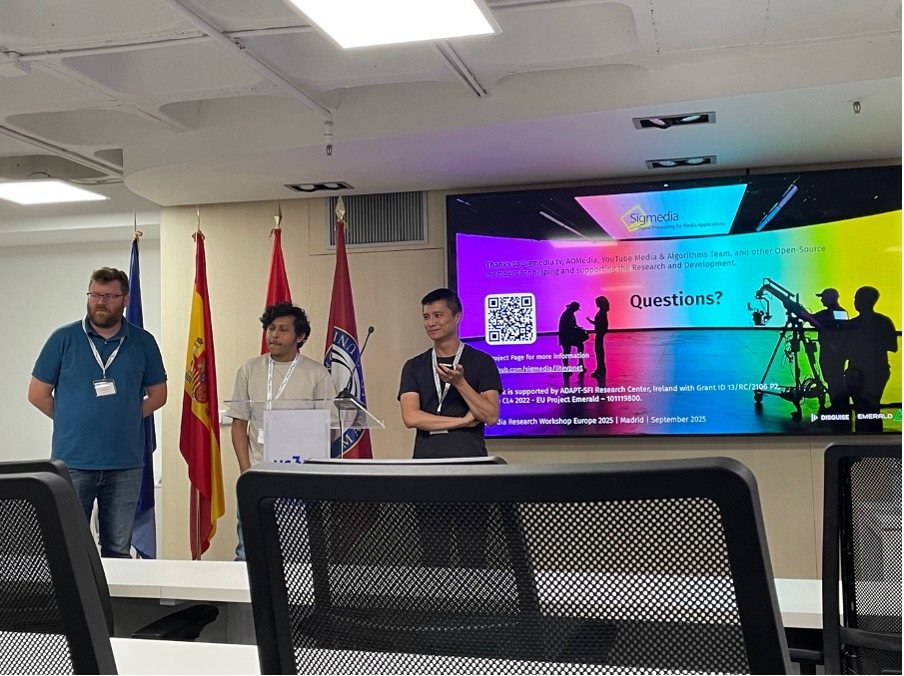

Sigmedia recently joined the Alliance for Open Media (AOMedia), the organisation
shaping the next generation of video compression standards.

Prof. François Pitié and Dr. Vibhoothi presented at the AOMedia Research
Workshop Europe 2025. Their talk, 'Beyond Streaming: Applying AV1 to
Cinema-Grade Virtual Production,' showcased how TCD's work on optimal video
encoding is pioneering energy-efficient, high-end film production using the AV1
codec.

