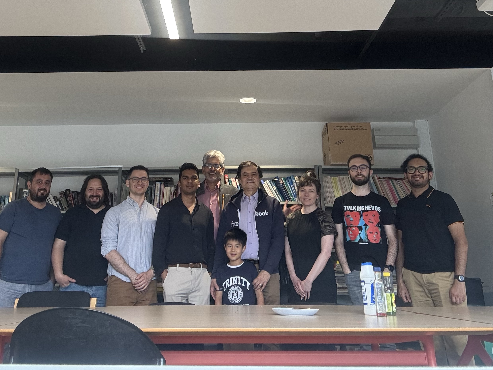

Sigmedia hosted a long-time friend, [Ioannis Katsavounidis](https://scholar.google.com/citations?user=XgljlGUAAAAJ&hl=en), at Trinity College Dublin.

The [Sigmedia Team](www.sigmedia.tv) gave Ioannis a tour of the lab and introduced him to our current research. Students had the chance to speak with him about machine learning and AI in video processing — covering motion metrics, deblurring, upsampling, AI teaching assistants, and hybrid ML video compression models. It was a great opportunity to exchange ideas with someone who has shaped perceptual video quality and encoding optimisation from both industry and academia.

-----

About Ioannis Katsavounidis (https://scholar.google.com/citations?user=XgljlGUAAAAJ&hl=en): A leading figure in video compression and quality assessment. He is a co-collaborator of VMAF, Netflix's perceptual video quality metric, and inventor of the Dynamic Optimizer, Netflix's per-shot encoding optimisation framework — both recognised with a Technical Emmy in 2021. He was Senior Research Scientist at Netflix (2015–2018) and currently Research Scientist on Meta's Video Infrastructure team, where he oversaw development of the Scalable Video Processor (MSVP), an Emmy-winning custom ASIC for datacentre transcoding and quality measurement. He has served as co-chair of the Software Implementation Working Group at the Alliance for Open Media and co-chair at the Video Quality Experts Group. His career spans academia (Associate Professor, University of Thessaly), industry R&D, and over 150 publications and 40 patents in video compression, quality assessment, and perceptual optimisation. Find him on [linkedin](https://www.linkedin.com/in/ioannis-katsavounidis-a736503/).

About Sigmedia Group (www.sigmedia.tv): Based at Trinity College Dublin, the Sigmedia Group has pioneered digital signal processing for video since 1998. Founded by Academy Award-winner Prof. Anil Kokaram, and together with Francois Pitie, Naomi Harte and Nils Peters, the group has expanded over the years to encompass audio and speech processing. The visual processing side of the group focuses on motion estimation, post-production algorithms, and efficient AI video processing technologies for emerging media applications, including high dynamic range, Virtual Production (XR), and 360-degree videos.

----
#multimedia #signalprocessing #trinitycollegedublin #tcd
