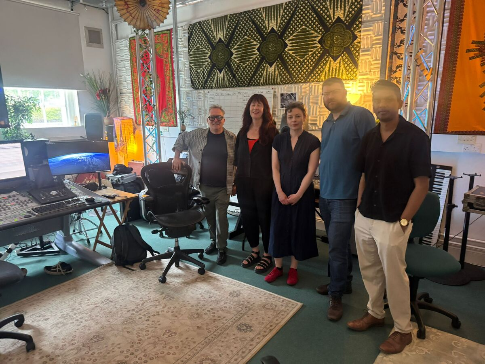
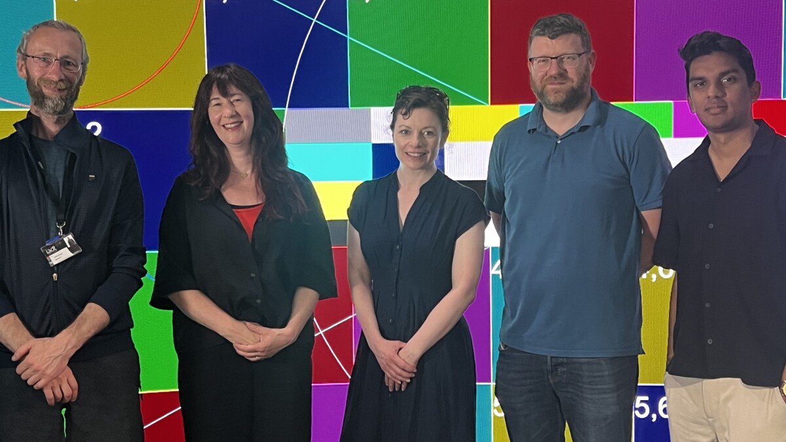

Great visit to our neighbours at the National Film School, Institute of Art, Design + Technology (IADT), Dún Laoghaire!

Members of Sigmedia and [MMT](https://www.tcd.ie/eleceng/mmt/) met with award-winning filmmaker [David
Keating](https://research.iadt.ie/en/persons/david-keating/) and [Andrew
Edgar](https://research.iadt.ie/en/persons/andrew-edgar/) for a brilliant exchange of ideas.

We toured their Immersive Studio, had fantastic conversations spanning LED
virtual production walls, AI, and the future of cinema. Looking forward to
future collaborations!

----
#multimedia #signalprocessing #trinitycollegedublin #tcd #virtualproduction #vp #IADT

